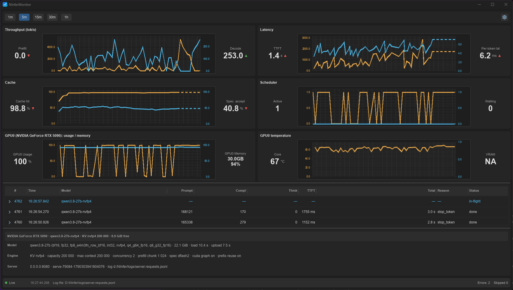

# NInferMonitor

A cross-platform desktop app (Rust + Slint + Plotters) that monitors and
controls the NInfer inference server. It tails the server request log
(`server.requests.jsonl`, JSON Lines) in real time — `tail -f` semantics — and
displays the core operational details of a running server in a live GUI
dashboard: token throughput, TTFT, latency, KV-cache occupancy, scheduler
state, and per-request details. It also starts, restarts, and stops the
server: NInfer configurations (a name plus the command line options for
`ninfer-serve`) are registered and managed in the Control tab, and the
selected one is launched from the NInfer installation folder.

The log is produced by `ninfer-serve` via the `--request-log-jsonl` flag.
When a configuration does not set the flag, the app appends
`--request-log-jsonl <log-file-folder>/ninfer-monitor/server.requests.jsonl`
to the launched command line and tails that file (the previous app-managed log
file is deleted before each start, so each run starts with a fresh log).

## Prerequisites

NInferMonitor tails the request log produced by the NInfer server:

- [NInfer](https://github.com/Neroued/ninfer) — the main NInfer server.
- [ninfer-windows](https://github.com/natpate/ninfer-windows) — the Windows
  port of NInfer.

## Screenshot



The Monitor tab: KPI widgets with dual-axis charts (throughput, latency,
cache, scheduler), the request table with an expanded request detail row, the
server-info panel, and the status bar.

## Features

- **Server control** — the Control tab registers NInfer configurations (a name
  plus the command line options for `ninfer-serve` from the NInfer
  installation folder) and starts, restarts, and stops the selected one; a
  running configuration is marked with a green dot, a failed start or exit is
  marked red with the exit code and the captured console output; Add and
  Delete (with a confirmation dialog); edits are validated and persisted as
  you type.
- **Configurations from launcher scripts** — when the installation folder is
  selected and the app has no configurations yet, it scans the folder for
  launcher scripts (`.bat` on Windows, `.sh` on Linux) that invoke
  `ninfer-serve` directly and pre-creates a configuration from each one; the
  Settings tab's **Import Configurations** button imports from the selected
  folder at any time, skipping the names that already exist.
- **Automatic restart of the running configuration** — the name of the
  configuration the app started is persisted; when the app opens and the
  configuration still exists, it is restarted automatically. Closing the app
  stops every tracked server process (releasing its GPU memory).
- **Startup screen** — shown when the NInfer installation folder is not
  configured or is invalid (a folder is valid only if it contains the
  `ninfer-serve` executable); a valid folder passed as a command-line argument
  skips the startup screen.
- **Tab layout** — a vertical tab bar on the left: the **Control**,
  **Monitor**, and **Settings** tabs (Control by default) and, at the bottom,
  the **Update** button (shown only when a new release is available) and the
  **About** button; the Monitor tab is the dashboard, its toolbar holds only
  the chart time-window selector, and the status bar shows the NInfer
  installation folder.
- **Real-time tailing** — polls the log file (default 500 ms, configurable
  100–5000 ms), backfills existing contents on first open, detects
  truncation/rotation, and retries a deleted or unreadable file without
  crashing.
- **Live KPIs** — eight KPI cards (decode and prefill throughput, active and
  waiting requests, avg TTFT, avg decode latency per token, prefix-cache hit
  rate, speculative acceptance), each with a trend indicator, updated at
  ≤ 4 Hz; error and skipped-line counts are shown in the status bar without
  trend indicators.
- **Time-series charts** — four Plotters dual-axis line charts (Throughput,
  Latency, Cache %, Scheduler) with a global time-window selector
  (1 m / 5 m / 15 m / 30 m / 1 h), re-rendered whenever the frame could change
  (new data, a resize, or the current time advancing a full second) — a
  series without new data is extended with a dashed horizontal tail to the
  current time —
  with a "server restarted" marker on new `server_start` events.
- **Request table** — newest-first rows (id, time, model, prompt/completion/
  thinking tokens, TTFT, total time, finish reason, status), color-coded
  (normal / slow / error), inline expandable detail with the full
  `request_done` payload, bounded row cap (default 1000).
- **Server info panel** — model, engine, GPU, memory, and server fields from
  the latest `server_start` event.
- **Robust parsing** — malformed lines are skipped and counted; unknown events
  and fields are ignored (forward compatible with newer schema versions).
- **Update checks** — a background check on a configurable period
  (1–14 days, default 3) opens the "New version available" dialog (OK
  downloads and launches the installer); the Settings tab's
  **Check for updates** button runs the check immediately and shows an
  "Up to date" dialog when current.
- **Settings & persistence** — the NInfer installation folder, the log file
  folder, the log file and GPU poll intervals, max requests, the temperature
  unit, the chart window, the registered configurations, the running
  configuration, the update-check settings, the window geometry, and the
  splitter fractions persisted to
  `$HOME/.ninfer-monitor/config.json`; the app never crashes on a missing or
  malformed config.
- **Cross-platform** — Windows, Linux, macOS from a single codebase.

## Building

- Rust: stable (edition 2024).
- Slint compiles a C++ core, so **MSVC is required on Windows** (`cl.exe` is
  not on PATH by default). Run cargo inside the VS developer environment:

```bat
call "C:\Program Files\Microsoft Visual Studio\2022\Community\VC\Auxiliary\Build\vcvars64.bat"
cargo build
```

or use the repo wrapper: `cmd /c vs-cargo.bat build`.

| Task | Command (inside the VS env) |
|---|---|
| Build | `cargo build` |
| Run | `cargo run` |
| Tests | `cargo test` |
| Screenshot tests | `cargo test --test screenshot` |
| Record screenshots | `$env:UPDATE_SNAPSHOTS=1; cargo test --test screenshot` |
| Lint | `cargo clippy --all-targets` |
| Format check | `cargo fmt --check` |
| Installer (NSIS) | `cmd /c vs-cargo.bat packager --release` |

## Usage

```
ninfer-monitor [install-folder] [--config <path>]
```

- `install-folder` — the NInfer installation folder (it must contain the
  `ninfer-serve` executable); a valid folder skips the startup screen.
- `--config <path>` — use a different config file location.

Controls: the left tab bar — the **Control** tab (start / restart / stop and
manage the NInfer configurations), the **Monitor** tab (the dashboard and the
chart time-window selector), the **Settings** tab (the installation folder,
the log file folder, the poll intervals, max requests, the temperature unit,
the update-check settings, Import Configurations, and Check for updates), and
the **Update** (when a new release is available) and **About** buttons.

## License

See [LICENSE.md](LICENSE.md).

The UI is built with [Slint](https://slint.dev); the About dialog includes 
Slint's `AboutSlint` attribution widget.

[](https://slint.dev)

