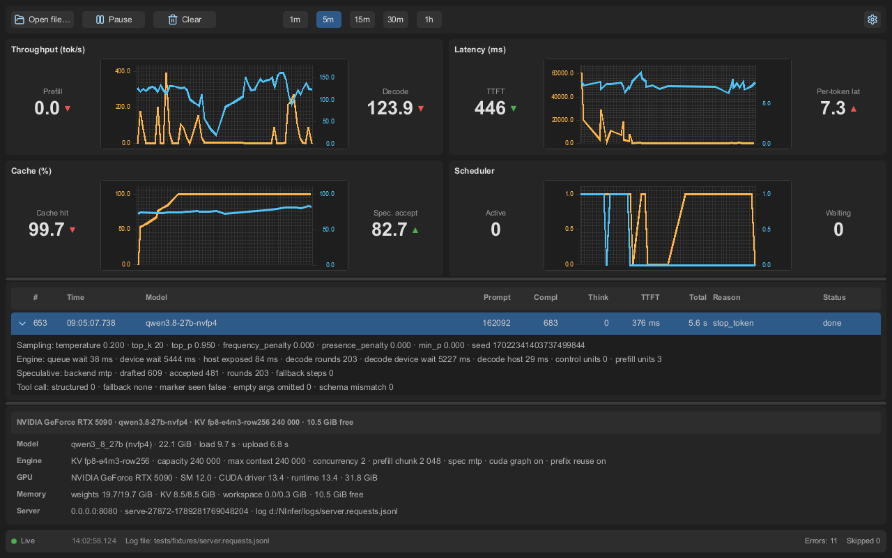

# NInferMonitor

A cross-platform desktop app (Rust + Slint + Plotters) that tails the NInfer
server request log (`server.requests.jsonl`, JSON Lines) in real time —
`tail -f` semantics — and displays the core operational details of a running
NInfer inference server in a live GUI dashboard: token throughput, TTFT,
latency, KV-cache occupancy, scheduler state, and per-request details.

The log is produced by `ninfer-serve` via the `--request-log-jsonl` flag.

## Prerequisites

NInferMonitor tails the request log produced by the NInfer server:

- [NInfer](https://github.com/Neroued/ninfer) — the main NInfer server.
- [ninfer-windows](https://github.com/natpate/ninfer-windows) — the Windows
  port of NInfer.

## Screenshot



Live dashboard: KPI widgets with dual-axis charts (throughput, latency, cache,
scheduler), the request table with an expanded request detail row, the
server-info panel, and the status bar.

## Features

- **Real-time tailing** — polls the log file (default 500 ms, configurable
  100–5000 ms), backfills existing contents on first open, detects
  truncation/rotation, and retries a deleted or unreadable file without
  crashing.
- **Live KPIs** — eight KPI cards (decode and prefill throughput, active and
  waiting requests, avg TTFT, avg decode latency per token, prefix-cache hit
  rate, speculative acceptance), each with a trend indicator, updated at
  ≤ 4 Hz; error and skipped-line counts are shown in the status bar without
  trend indicators.
- **Time-series charts** — four Plotters dual-axis line charts (Throughput,
  Latency, Cache %, Scheduler) with a global time-window selector
  (1 m / 5 m / 15 m / 1 h), re-rendered at 2 Hz, with a "server restarted"
  marker on new `server_start` events.
- **Request table** — newest-first rows (id, time, model, prompt/completion/
  thinking tokens, TTFT, total time, finish reason, status), color-coded
  (normal / slow / error), inline expandable detail with the full
  `request_done` payload, bounded row cap (default 1000).
- **Server info panel** — model, engine, GPU, memory, and server fields from
  the latest `server_start` event.
- **Robust parsing** — malformed lines are skipped and counted; unknown events
  and fields are ignored (forward compatible with newer schema versions).
- **Settings & persistence** — poll interval, max requests, chart window, last
  log path, window geometry, and splitter fractions persisted to
  `$HOME/.ninfer-monitor/config.json`; the app never crashes on a missing or
  malformed config.
- **Cross-platform** — Windows, Linux, macOS from a single codebase.

## Building

- Rust: stable (edition 2024).
- Slint compiles a C++ core, so **MSVC is required on Windows** (`cl.exe` is
  not on PATH by default). Run cargo inside the VS developer environment:

```bat
call "C:\Program Files\Microsoft Visual Studio\2022\Community\VC\Auxiliary\Build\vcvars64.bat"
cargo build
```

or use the repo wrapper: `cmd /c vs-cargo.bat build`.

| Task | Command (inside the VS env) |
|---|---|
| Build | `cargo build` |
| Run | `cargo run` |
| Tests | `cargo test` |
| Screenshot tests | `cargo test --test screenshot` |
| Record screenshots | `$env:UPDATE_SNAPSHOTS=1; cargo test --test screenshot` |
| Lint | `cargo clippy --all-targets` |
| Format check | `cargo fmt --check` |
| Installer (NSIS) | `cmd /c vs-cargo.bat packager --release` |

## Usage

```
ninfer-monitor [path] [--poll <ms>] [--config <path>]
```

- `[path]` — log file to open (overrides the persisted `last_path`).
- `--poll <ms>` — poll interval override (clamped to 100–5000 ms).
- `--config <path>` — use a different config file location.

Controls: **Open file…**, **Pause/Resume**, **Clear**, the chart
time-window selector, and **Settings** (poll interval, max requests, About).

## License

See [LICENSE.md](LICENSE.md).
